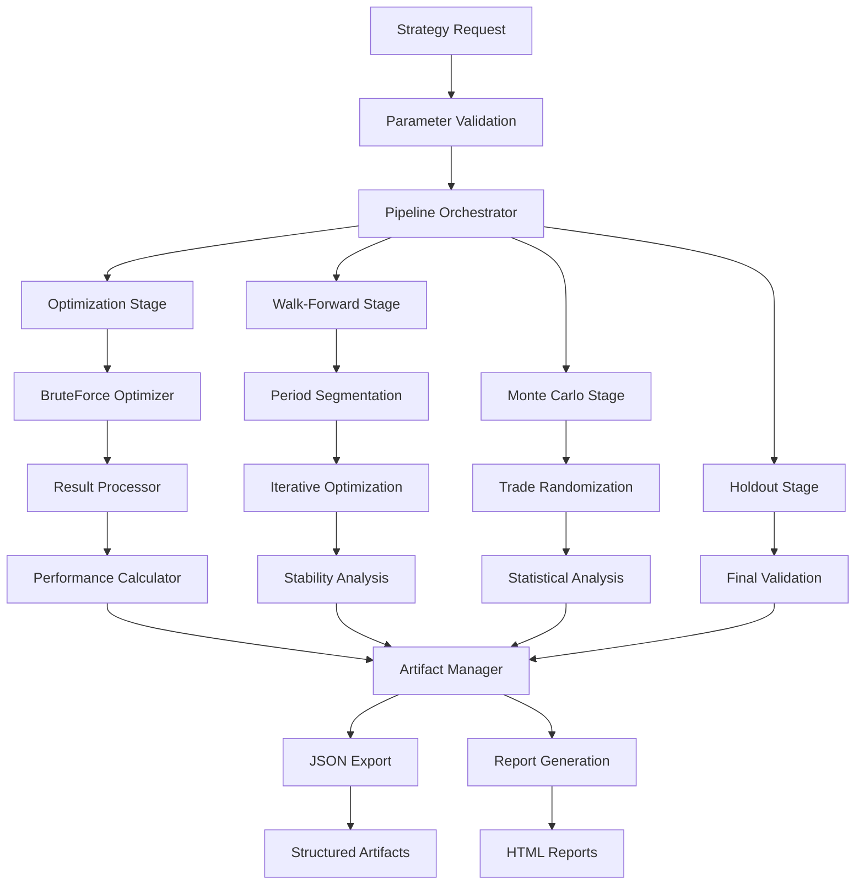

# StockSharp Advanced Backtesting Library - Technical Requirements Document (MVP)

## Technical Requirements

### 1. StockSharp Framework Dependencies

- **Core Framework**: StockSharp.Algo for Strategy and Indicator classes
- **Optimization**: StockSharp.Algo.Strategies.Optimization.BruteForceOptimizer
- **Data Management**: StockSharp data connector ecosystem
- **Compatibility**: Full compatibility with StockSharp ecosystem and existing strategies

### 2. Performance Requirements

- **Optimization Speed**: Leverage BruteForceOptimizer's native parallel processing
- **Memory Management**: Efficient handling of multi-symbol, multi-timeframe data with automatic cleanup
- **Resource Monitoring**: Track memory usage and performance bottlenecks during optimization
- **Error Resilience**: Graceful handling of optimization failures with partial result recovery
- **Report Generation**: Fast HTML report creation with interactive charts

### 3. Platform Compatibility

- **Target Framework**: .NET 10 with StockSharp compatibility
- **Cross-Platform**: Support Windows, Linux, macOS where StockSharp supports
- **Integration**: Seamless integration with StockSharp Studio and development tools

### 4. Output Requirements

- **JSON Standards**: Structured, well-documented JSON schemas
- **HTML Reports**: Self-contained static reports with TradingView charts
- **StockSharp Compatibility**: Strategy configurations deployable to StockSharp live trading
- **Documentation**: Comprehensive validation reports meeting institutional standards

## Implementation Roadmap

### Phase 1: StockSharp Integration Foundation

**Objectives**: Build enhanced wrappers around StockSharp's core optimization

**Key Deliverables**:

- Enhanced Strategy base classes extending StockSharp Strategy
- BruteForceOptimizer integration with result capture and processing
- Basic performance metrics enhancement beyond StockSharp defaults
- JSON export functionality for strategy configurations

### Phase 2: Validation Framework

**Objectives**: Add comprehensive validation on top of BruteForceOptimizer results

**Key Deliverables**:

- Walk-forward analysis using segmented BruteForceOptimizer runs
- Out-of-sample validation with holdout data management
- Monte Carlo validation and statistical significance testing
- Overfitting detection and strategy ranking algorithms

### Phase 3: Comprehensive Reporting

**Objectives**: Generate publication-quality reports and artifacts

**Key Deliverables**:

- Complete JSON artifact generation for all optimization components
- Static HTML report generation using Next.js template integration
- Multi-symbol and multi-timeframe support with proper data synchronization
- Performance attribution and transaction cost analysis

### Phase 4: Production Integration (Stretch Goal)

**Objectives**: Enable seamless deployment to StockSharp live trading

**Key Deliverables**:

- Validated strategy deployment configurations
- Live trading integration maintaining StockSharp compatibility
- Real-time monitoring and performance tracking
- Production-grade error handling and operational monitoring

## Success Metrics and Validation

### Technical Performance

- **Optimization Integration**: 100% compatibility with StockSharp BruteForceOptimizer
- **Validation Accuracy**: 90%+ correlation between validation and live performance
- **Report Quality**: Comprehensive HTML reports generated within 5 minutes
- **Framework Compatibility**: Full compatibility with existing StockSharp strategies

### Strategy Quality Improvement

- **Overfitting Reduction**: 70% reduction in performance degradation vs. unvalidated strategies
- **Validation Coverage**: 95% of strategies pass multi-stage validation before deployment
- **Risk Management**: Enhanced risk controls reduce maximum drawdown by 40%
- **Development Efficiency**: 60% reduction in strategy development time using StockSharp foundation

### Production Readiness

- **Deployment Success**: 90% of validated strategies achieve positive live performance
- **Operational Reliability**: 99%+ successful strategy deployment to StockSharp live trading
- **Documentation Quality**: Generated reports require minimal manual review
- **Compliance**: Validation framework meets institutional backtesting standards

## MVP Scope for Phase 1

### Core MVP Features

- Enhanced Strategy base classes extending StockSharp Strategy
- BruteForceOptimizer integration with result capture
- Basic performance metrics beyond StockSharp defaults
- JSON export for strategy configurations, market data, and trades
- Static HTML report generation using Next.js template

### Out of Scope for MVP

- Walk-forward analysis (Phase 2)
- Monte Carlo validation (Phase 2)
- Advanced multi-symbol coordination (Phase 3)
- Live trading integration (Phase 4)

## Technical Architecture

### Project Structure

Based on expert consultation, the library is organized as a modular pipeline with the following structure:

```
StockSharp.AdvancedBacktest/
├── Core/
│   ├── Pipeline/
│   │   ├── IPipelineStage.cs
│   │   ├── PipelineOrchestrator.cs
│   │   └── PipelineContext.cs
│   ├── Configuration/
│   │   ├── PipelineConfiguration.cs
│   │   └── ConfigurationExtensions.cs
│   ├── Strategies/
│   │   ├── EnhancedStrategyBase.cs
│   │   └── IParameterValidator.cs
│   ├── Optimization/
│   │   ├── BruteForceOptimizerWrapper.cs
│   │   └── OptimizationStageManager.cs
│   ├── Validation/
│   │   ├── WalkForwardValidator.cs
│   │   ├── MonteCarloValidator.cs
│   │   └── OutOfSampleValidator.cs
│   ├── Metrics/
│   │   ├── PerformanceCalculator.cs
│   │   ├── MetricsExporter.cs
│   │   └── RiskAnalyzer.cs
│   ├── Data/
│   │   ├── MarketDataManager.cs
│   │   ├── DataPartitionManager.cs
│   │   └── CacheManager.cs
│   └── Artifacts/
│       ├── ArtifactManager.cs
│       ├── JsonExporter.cs
│       └── ReportGenerator.cs
├── Infrastructure/
│   ├── Data/
│   │   ├── FileSystemDataStore.cs
│   │   ├── HighPerformanceFileReader.cs
│   │   └── BatchFileWriter.cs
│   ├── Logging/
│   │   └── StructuredLogger.cs
│   └── Serialization/
│       ├── JsonSerializationService.cs
│       └── OptimizedDataFormats.cs
├── Models/
│   ├── Pipeline/
│   │   ├── PipelineStage.cs
│   │   ├── StageInput.cs
│   │   └── StageOutput.cs
│   ├── Optimization/
│   │   ├── OptimizationResult.cs
│   │   ├── ParameterCombination.cs
│   │   └── OptimizationStatistics.cs
│   ├── Configuration/
│   │   ├── StrategyConfiguration.cs
│   │   ├── DataConfiguration.cs
│   │   └── ValidationConfiguration.cs
│   └── Data/
│       ├── TradeData.cs
│       ├── MarketDataSet.cs
│       └── PerformanceMetrics.cs
└── Extensions/
    ├── StrategyExtensions.cs
    ├── IndicatorExtensions.cs
    └── ConfigurationExtensions.cs
```

## Core Components

### 1. Enhanced Strategy Base Classes

#### EnhancedStrategyBase

**Responsibilities:**

- Inherit from StockSharp `Strategy` class maintaining full compatibility
- Provide enhanced parameter management with validation
- Track performance metrics during strategy execution
- Implement hooks for risk management validation
- Support optimization pipeline integration

**Data Contracts:**

```csharp
public abstract class EnhancedStrategyBase : Strategy
{
    public ParameterSet Parameters { get; protected set; }
    public PerformanceTracker Performance { get; private set; }
    public RiskManager RiskManager { get; protected set; }

    // Events for pipeline integration
    public event Action<TradeExecutionData> TradeExecuted;
    public event Action<PerformanceSnapshot> PerformanceUpdated;
    public event Action<RiskViolation> RiskViolationDetected;
}
```

#### ParameterSet

**Responsibilities:**

- Define optimization parameter ranges and constraints
- Validate parameter combinations before optimization
- Serialize/deserialize parameter configurations
- Support parameter space exploration

**Data Contracts:**

```csharp
public class ParameterSet
{
    public Dictionary<string, ParameterDefinition> Parameters { get; set; }
    public ValidationResult Validate(Dictionary<string, object> values);
    public IEnumerable<Dictionary<string, object>> GenerateCombinations();
    public string GetParameterHash(Dictionary<string, object> values);
}

public class ParameterDefinition
{
    public string Name { get; set; }
    public Type Type { get; set; }
    public object MinValue { get; set; }
    public object MaxValue { get; set; }
    public object Step { get; set; }
    public List<object> DiscreteValues { get; set; }
    public List<ValidationRule> ValidationRules { get; set; }
}
```

### 2. Data Pipeline Architecture

#### Pipeline Organization

Based on expert architectural review, the system uses a **modular pipeline with local file system storage** pattern:

**Key Design Principles:**
- **Single Responsibility**: Each pipeline stage handles one specific concern
- **Loose Coupling**: Stages communicate via structured JSON artifacts
- **Fail-Fast**: Each stage validates inputs before processing
- **Resumable**: Checkpoint-based recovery from failures
- **Observable**: Rich logging and progress tracking

#### PipelineOrchestrator

**Responsibilities:**

- Orchestrate the entire optimization workflow using modern .NET patterns
- Manage pipeline stages with dependency injection and channels
- Coordinate between different validation methods
- Control artifact generation and storage with hierarchical caching

**Data Contracts:**

```csharp
public class PipelineOrchestrator
{
    private readonly IServiceProvider _serviceProvider;
    private readonly ILogger<PipelineOrchestrator> _logger;

    public async Task<TOutput> ExecutePipelineAsync<TInput, TOutput>(
        TInput input,
        IEnumerable<Type> stageTypes,
        CancellationToken cancellationToken = default);
}

public class PipelineConfiguration
{
    public bool EnableOptimization { get; set; } = true;
    public bool EnableWalkForward { get; set; } = false; // Phase 2
    public bool EnableMonteCarlo { get; set; } = false;  // Phase 2
    public bool EnableHoldout { get; set; } = false;     // Phase 2
    public string OutputDirectory { get; set; }
    public DataConfiguration DataConfig { get; set; }
    public PerformanceConfiguration PerformanceConfig { get; set; }
    public ReportSettings ReportSettings { get; set; }
}

public class DataConfiguration
{
    public string BasePath { get; set; } = "./results";
    public string CacheDirectory { get; set; } = "./cache";
    public string TempDirectory { get; set; } = "./temp";
    public string MaxCacheSize { get; set; } = "10GB";
    public CleanupPolicy CleanupPolicy { get; set; }
}

public class PerformanceConfiguration
{
    public int MaxParallelSymbols { get; set; } = 4;
    public int MaxParallelTimeframes { get; set; } = 2;
    public int ChunkSizeMonths { get; set; } = 3;
    public int MemoryLimitMB { get; set; } = 4096;
}
```

#### BruteForceOptimizerWrapper

**Responsibilities:**

- Wrap StockSharp's BruteForceOptimizer with enhanced result capture
- Provide real-time progress monitoring
- Extract detailed optimization results
- Handle optimization failures gracefully

**Data Contracts:**

```csharp
public class BruteForceOptimizerWrapper
{
    public OptimizationSettings Settings { get; set; }
    public EnhancedStrategyBase StrategyTemplate { get; set; }

    public async Task<OptimizationStageResult> OptimizeAsync();
    public event Action<OptimizationProgress> ProgressReported;
    public event Action<ParameterCombinationResult> CombinationCompleted;
}

public class OptimizationStageResult : PipelineStageResult
{
    public List<ParameterCombinationResult> Results { get; set; }
    public ParameterCombinationResult BestResult { get; set; }
    public OptimizationStatistics Statistics { get; set; }
    public TimeSpan Duration { get; set; }
}
```

### 3. Performance Analysis Engine

#### PerformanceCalculator

**Responsibilities:**

- Calculate comprehensive performance metrics beyond StockSharp defaults
- Provide statistical analysis of trading results
- Support custom metric definitions
- Generate performance comparisons across parameter sets

**Data Contracts:**

```csharp
public class PerformanceCalculator
{
    public PerformanceMetrics Calculate(List<Trade> trades, List<PortfolioSnapshot> portfolioHistory);
    public ComparisonResult Compare(List<PerformanceMetrics> metrics);
    public RiskMetrics CalculateRisk(List<PortfolioSnapshot> portfolioHistory);
}

public class PerformanceMetrics
{
    // Basic Metrics
    public decimal TotalReturn { get; set; }
    public decimal AnnualizedReturn { get; set; }
    public decimal MaxDrawdown { get; set; }
    public int TotalTrades { get; set; }
    public decimal WinRate { get; set; }
    public decimal ProfitFactor { get; set; }

    // Advanced Metrics
    public decimal SharpeRatio { get; set; }
    public decimal SortinoRatio { get; set; }
    public decimal CalmarRatio { get; set; }
    public decimal Volatility { get; set; }
    public decimal Beta { get; set; }
    public decimal Alpha { get; set; }

    // Trade Analysis
    public TradeStatistics TradeStats { get; set; }
    public DrawdownAnalysis DrawdownStats { get; set; }
    public ReturnDistribution ReturnDistribution { get; set; }
}
```

#### MetricsRepository

**Responsibilities:**

- Store and retrieve performance metrics
- Provide querying capabilities for metric analysis
- Support metric aggregation across multiple runs
- Maintain historical performance data

**Data Contracts:**

```csharp
public interface IMetricsRepository
{
    Task SaveAsync(string strategyId, string runId, PerformanceMetrics metrics);
    Task<PerformanceMetrics> GetAsync(string strategyId, string runId);
    Task<List<PerformanceMetrics>> GetHistoryAsync(string strategyId);
    Task<MetricsComparison> CompareAsync(List<string> runIds);
}
```

### 4. Data Management System

#### DataPartitionManager

**Responsibilities:**

- Implement hierarchical data partitioning strategy
- Manage data locality for parallel processing optimization
- Coordinate shared cache usage across optimization runs
- Handle data lifecycle and cleanup policies

**Data Contracts:**

```csharp
public class DataPartitionManager
{
    private readonly DataConfiguration _config;
    private readonly ILogger<DataPartitionManager> _logger;

    public async Task<DataPartition> PreparePartitionAsync(OptimizationRequest request);
    public async Task<IEnumerable<DataChunk>> PartitionByTimeAsync(
        SecurityId security,
        TimeFrame timeframe,
        DateRange range,
        TimeSpan chunkSize = default);
}

public class DataPartition
{
    public string StrategyName { get; set; }
    public DateRange DateRange { get; set; }
    public string Symbol { get; set; }
    public string Timeframe { get; set; }
    public DataRequirements DataRequirements { get; set; }
    public ParameterSpace Parameters { get; set; }

    public string GetPartitionPath() =>
        $"by-strategy/{StrategyName}/by-date-range/{DateRange.Start:yyyyMMdd}_{DateRange.End:yyyyMMdd}/by-symbol/{Symbol}/by-timeframe/{Timeframe}";
}
```

#### ArtifactManager

**Responsibilities:**

- Manage structured storage of optimization artifacts using hierarchical partitioning
- Coordinate artifact generation across pipeline stages with shared caching
- Provide high-performance artifact retrieval and indexing
- Handle artifact cleanup and archival with configurable policies

**Data Contracts:**

```csharp
public class ArtifactManager
{
    private readonly IDataStore _dataStore;
    private readonly JsonSerializationService _serializer;
    private readonly ILogger<ArtifactManager> _logger;

    public ArtifactPath CreateArtifactPath(DataPartition partition, PipelineStage stage);
    public async Task StoreArtifactAsync<T>(ArtifactPath path, string filename, T data);
    public async Task<T> RetrieveArtifactAsync<T>(ArtifactPath path, string filename);
    public async Task GenerateReportAsync(ArtifactPath basePath);
    public async Task CleanupExpiredArtifactsAsync(CleanupPolicy policy);
}

public class ArtifactPath
{
    public string StrategyName { get; set; }
    public DateRange DateRange { get; set; }
    public string Symbol { get; set; }
    public string Timeframe { get; set; }
    public PipelineStage Stage { get; set; }
    public string ParameterHash { get; set; }

    public string GetFullPath() =>
        $"by-strategy/{StrategyName}/by-date-range/{DateRange.Start:yyyyMMdd}_{DateRange.End:yyyyMMdd}/by-symbol/{Symbol}/by-timeframe/{Timeframe}/{Stage}";
}
```

#### MarketDataManager

**Responsibilities:**

- Implement efficient market data caching and retrieval
- Manage data format optimization (Parquet for time series)
- Coordinate data sharing across multiple optimization runs
- Handle data validation and integrity checks

**Data Contracts:**

```csharp
public class MarketDataManager
{
    private readonly IMarketDataCache _cache;
    private readonly OptimizedDataFormats _dataFormats;

    public async Task<MarketDataSet> GetOrLoadAsync(DataRequirements requirements);
    public async Task<IEnumerable<DataChunk>> PartitionByTimeAsync(
        SecurityId security,
        TimeFrame timeframe,
        DateRange range,
        TimeSpan chunkSize = default);
    public async Task CacheIndicatorDataAsync<T>(string indicatorType, string parametersHash, T data);
}
```

#### JsonSerializationService

**Responsibilities:**

- High-performance JSON serialization using System.Text.Json
- Support progressive loading for large datasets
- Implement compressed storage for large time series data
- Maintain schema versioning and validation

**Data Contracts:**

```csharp
public class JsonSerializationService
{
    private static readonly JsonSerializerOptions DefaultOptions = new()
    {
        PropertyNamingPolicy = JsonNamingPolicy.CamelCase,
        WriteIndented = true,
        DefaultIgnoreCondition = JsonIgnoreCondition.WhenWritingNull,
        Converters =
        {
            new JsonStringEnumConverter(),
            new DateTimeConverter(),
            new DecimalConverter()
        }
    };

    public async Task SerializeToFileAsync<T>(T data, string filePath, CancellationToken cancellationToken = default);
    public async Task<T?> DeserializeFromFileAsync<T>(string filePath, CancellationToken cancellationToken = default);
    public async Task ExportWithPaginationAsync<T>(IEnumerable<T> data, string basePath, int pageSize = 1000);
}

public class ProgressiveJsonExporter
{
    public async Task ExportStrategyConfigAsync(ArtifactPath path, StrategyConfiguration config);
    public async Task ExportMarketDataReferenceAsync(ArtifactPath path, MarketDataReference data);
    public async Task ExportTradesAsync(ArtifactPath path, List<TradeExecution> trades);
    public async Task ExportMetricsAsync(ArtifactPath path, PerformanceMetrics metrics);
    public async Task ExportOptimizationResultsAsync(ArtifactPath path, OptimizationStageResult results);
}

public class ExportManifest
{
    public string SchemaVersion { get; set; }
    public DateTime ExportTimestamp { get; set; }
    public Dictionary<string, FileInfo> Files { get; set; }
    public ExportStatistics Statistics { get; set; }
}
```

### 5. Report Generation System

#### ReportGenerator

**Responsibilities:**

- Generate self-contained HTML reports
- Integrate with Next.js template system
- Create interactive visualizations
- Support multiple report formats and themes

**Data Contracts:**

```csharp
public class ReportGenerator
{
    public ReportConfiguration Configuration { get; set; }

    public async Task<ReportResult> GenerateAsync(ArtifactPath basePath);
    public async Task<string> GenerateHtmlReportAsync(ReportData data);
    public async Task<byte[]> GeneratePdfReportAsync(ReportData data); // Future
}

public class ReportConfiguration
{
    public string TemplatePath { get; set; }
    public ReportTheme Theme { get; set; }
    public List<ChartConfiguration> Charts { get; set; }
    public bool IncludeInteractiveCharts { get; set; }
    public bool IncludeTradeDetails { get; set; }
}

public class ReportData
{
    public StrategyMetadata Strategy { get; set; }
    public PipelineResults Results { get; set; }
    public List<ChartData> Charts { get; set; }
    public ReportSummary Summary { get; set; }
}
```

## Integration Points

### StockSharp Dependencies

- `StockSharp.Algo.Strategies.Strategy` - Base strategy class
- `StockSharp.Algo.Strategies.Optimization.BruteForceOptimizer` - Core optimization engine
- `StockSharp.Algo.Indicators.*` - Indicator library
- `StockSharp.Messages` - Market data and trading messages
- `StockSharp.BusinessEntities` - Securities, portfolios, trades

### Modern .NET Dependencies

Based on expert .NET guidance, the library leverages modern .NET 10 patterns:

- `Microsoft.Extensions.Hosting` - Host builder pattern for pipeline orchestration
- `Microsoft.Extensions.Configuration.Json` - Configuration management with IOptions
- `Microsoft.Extensions.DependencyInjection` - Dependency injection throughout
- `Microsoft.Extensions.Logging` - Structured logging with Serilog
- `System.Threading.Channels` - High-performance pipeline coordination
- `System.Text.Json` - High-performance JSON serialization
- `System.Buffers` - Memory-efficient data processing with ArrayPool/MemoryPool

## Optimization Pipeline Flow

### Pipeline Startup Process

```csharp
// 1. Pipeline Initialization
var pipeline = new OptimizationPipeline(configuration);
var request = new StrategyRequest
{
    StrategyType = typeof(MyEnhancedStrategy),
    Symbol = "AAPL",
    Timeframe = TimeFrame.Hour,
    DateRange = new DateRange(startDate, endDate),
    Parameters = parameterSet
};

// 2. Pipeline Execution
var result = await pipeline.ExecuteAsync(request);
```

### Detailed Pipeline Stages

#### Stage 1: Optimization (MVP)

**Process Flow:**

1. **Parameter Validation**
   - Validate parameter ranges and constraints
   - Generate parameter combinations
   - Create parameter hash for artifact organization

2. **Strategy Preparation**
   - Instantiate EnhancedStrategyBase with parameters
   - Configure market data sources
   - Set up performance tracking hooks

3. **BruteForce Optimization Execution**
   - Wrap StockSharp's BruteForceOptimizer
   - Execute parallel optimization runs
   - Capture real-time results through event hooks

4. **Result Processing**
   - Calculate enhanced performance metrics
   - Rank results by configurable criteria
   - Identify best parameter combinations

5. **Artifact Generation**
   - Export strategy configurations to JSON
   - Export market data and trade details
   - Generate performance metrics artifacts
   - Create HTML reports with interactive charts

#### Stage 2: Walk-Forward Analysis (Phase 2)

**Process Flow:**

1. **Period Segmentation**
   - Divide date range into training/testing windows
   - Configure rolling window parameters
   - Set up out-of-sample periods

2. **Iterative Optimization**
   - Run optimization on each training window
   - Test best parameters on subsequent periods
   - Track performance degradation over time

3. **Stability Analysis**
   - Measure parameter stability across periods
   - Identify robust parameter ranges
   - Calculate walk-forward efficiency metrics

#### Stage 3: Monte Carlo Validation (Phase 2)

**Process Flow:**

1. **Trade Sequence Randomization**
   - Shuffle historical trade sequences
   - Maintain trade distribution characteristics
   - Generate multiple alternative histories

2. **Statistical Analysis**
   - Calculate confidence intervals
   - Measure statistical significance
   - Identify luck vs. skill factors

#### Stage 4: Holdout Validation (Phase 2)

**Process Flow:**

1. **Final Validation**
   - Test on completely unseen data
   - Measure real-world performance expectations
   - Generate deployment confidence metrics

### Data Flow Architecture



### Enhanced Data Partitioning Strategy

Based on expert data architecture review, the system implements **hierarchical data partitioning with shared caching** for optimal performance:

#### Primary Partitioning Scheme

```
results/
├── by-strategy/
│   └── {strategy-name}/
│       ├── by-date-range/
│       │   └── {start-yyyymmdd}_{end-yyyymmdd}/
│       │       ├── by-symbol/
│       │       │   └── {symbol}/
│       │       │       └── by-timeframe/
│       │       │           └── {timeframe}/
│       │       │               ├── raw-data/           # Market data cache
│       │       │               ├── optimization/       # Stage 1 results
│       │       │               ├── validation/         # Stage 2-4 results
│       │       │               └── reports/           # Generated reports
│       │       └── multi-symbol/                      # Cross-symbol strategies
│       │           └── {symbol-basket}/
│       │               └── {timeframe}/
│       └── metadata/
│           ├── strategy-definition.json
│           ├── parameter-schemas.json
│           └── version-history.json
├── shared-cache/                                      # Reusable data cache
│   ├── market-data/
│   │   └── {symbol}/
│   │       └── {timeframe}/
│   │           └── {year}/
│   │               └── {month}/
│   │                   ├── ohlcv.parquet           # Columnar format for speed
│   │                   └── metadata.json
│   └── indicator-cache/                             # Pre-calculated indicators
│       └── {indicator-type}/
│           └── {parameters-hash}/
│               └── {symbol}_{timeframe}_data.parquet
└── temp/                                            # Temporary processing files
    └── {session-id}/
        ├── processing/
        └── cleanup-after-{timestamp}/
```

#### Pipeline Stage Artifacts

```
results/by-strategy/{strategy}/by-date-range/{dates}/by-symbol/{symbol}/by-timeframe/{timeframe}/
├── optimization/                    # Stage 1: Basic Optimization (MVP)
│   └── {parameter-hash}/
│       ├── manifest.json               # Artifact manifest and metadata
│       ├── strategy-config.json        # Strategy parameters
│       ├── market-data.json           # OHLCV data reference
│       ├── trades.json               # Trade execution details
│       ├── performance-metrics.json   # Calculated metrics
│       ├── optimization-results.json  # Full optimization results
│       ├── index.html                # Next.js report template
│       └── assets/                   # Static assets for report
│           ├── app.js                  # JavaScript bundle
│           ├── styles.css              # Report styling
│           └── charts/                 # Chart data files
│               ├── equity-curve.json
│               ├── trade-distribution.json
│               └── drawdown-analysis.json
├── validation/                      # Stage 2-4: Validation (Phase 2)
│   ├── walk-forward/
│   │   └── {analysis-id}/
│   │       ├── manifest.json
│   │       ├── walk-forward-config.json
│   │       ├── period-results.json
│   │       ├── stability-metrics.json
│   │       └── efficiency-metrics.json
│   ├── monte-carlo/
│   │   └── {simulation-id}/
│   │       ├── manifest.json
│   │       ├── simulation-config.json
│   │       ├── simulation-results.json
│   │       └── confidence-intervals.json
│   └── holdout/
│       └── {validation-id}/
│           ├── manifest.json
│           ├── holdout-config.json
│           └── validation-results.json
└── reports/                         # Consolidated Reports
    ├── pipeline-summary.json         # Overall pipeline results
    ├── best-configurations.json      # Top performing configurations
    ├── risk-analysis.json           # Comprehensive risk metrics
    └── index.html                   # Executive summary report
```

#### Performance Optimizations

**1. Batch Processing with Checkpoints:**
- Process optimizations in parameter batches with intermediate checkpointing
- Resume capability for interrupted optimization runs
- Memory-efficient parameter space exploration

**2. Hierarchical Caching:**
- Three-tier caching system (memory → SSD cache → full storage)
- Shared market data cache across optimization runs
- Pre-calculated indicator caching with parameter hashing

**3. Resource-Aware Execution:**
- Memory and disk I/O throttling to prevent system exhaustion
- Parallel processing by symbol/timeframe combinations
- Automatic cleanup of temporary files based on configurable policies

### Artifact Manifest Structure

```json
{
  "schemaVersion": "1.0.0",
  "artifactType": "optimization",
  "generatedAt": "2024-12-27T10:30:00Z",
  "pipelineStage": "optimization",
  "strategyMetadata": {
    "name": "MyEnhancedStrategy",
    "version": "1.0.0",
    "parameters": { ... },
    "parameterHash": "abc123def456"
  },
  "dataMetadata": {
    "symbol": "AAPL",
    "timeframe": "1H",
    "dateRange": {
      "start": "2024-01-01T00:00:00Z",
      "end": "2024-12-31T23:59:59Z"
    },
    "totalBars": 8760,
    "totalTrades": 245
  },
  "files": {
    "strategy-config.json": {
      "size": 2048,
      "hash": "sha256:...",
      "description": "Strategy configuration and parameters"
    },
    "performance-metrics.json": {
      "size": 4096,
      "hash": "sha256:...",
      "description": "Calculated performance metrics"
    }
  },
  "statistics": {
    "totalParameterCombinations": 1000,
    "successfulRuns": 987,
    "executionTimeSeconds": 1234.56,
    "bestSharpeRatio": 1.85,
    "bestMaxDrawdown": -0.12
  }
}
```
