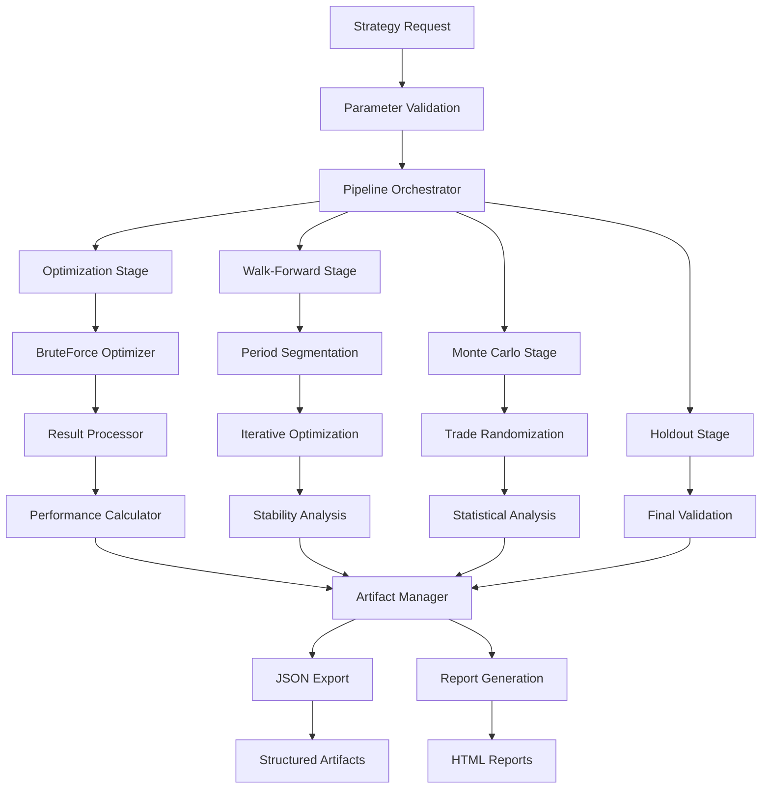

# StockSharp Advanced Backtesting Library - Technical Requirements Document (MVP)

## Technical Requirements

### 1. StockSharp Framework Dependencies

- **Core Framework**: StockSharp.Algo for Strategy and Indicator classes
- **Optimization**: StockSharp.Algo.Strategies.Optimization.BruteForceOptimizer
- **Data Management**: StockSharp data connector ecosystem
- **Compatibility**: Full compatibility with StockSharp ecosystem and existing strategies

### 2. Performance Requirements

- **Optimization Speed**: Leverage BruteForceOptimizer's native parallel processing
- **Memory Management**: Efficient handling of multi-symbol, multi-timeframe data with automatic cleanup
- **Resource Monitoring**: Track memory usage and performance bottlenecks during optimization
- **Error Resilience**: Graceful handling of optimization failures with partial result recovery
- **Report Generation**: Fast HTML report creation with interactive charts

### 3. Platform Compatibility

- **Target Framework**: .NET 10 with StockSharp compatibility
- **Cross-Platform**: Support Windows, Linux, macOS where StockSharp supports
- **Integration**: Seamless integration with StockSharp Studio and development tools

### 4. Output Requirements

- **JSON Standards**: Structured, well-documented JSON schemas
- **HTML Reports**: Self-contained static reports with TradingView charts
- **StockSharp Compatibility**: Strategy configurations deployable to StockSharp live trading
- **Documentation**: Comprehensive validation reports meeting institutional standards

## Implementation Roadmap

### Phase 1: StockSharp Integration Foundation

**Objectives**: Build enhanced wrappers around StockSharp's core optimization

**Key Deliverables**:

- Enhanced Strategy base classes extending StockSharp Strategy
- BruteForceOptimizer integration with result capture and processing
- Basic performance metrics enhancement beyond StockSharp defaults
- JSON export functionality for strategy configurations

### Phase 2: Validation Framework

**Objectives**: Add comprehensive validation on top of BruteForceOptimizer results

**Key Deliverables**:

- Walk-forward analysis using segmented BruteForceOptimizer runs
- Out-of-sample validation with holdout data management
- Monte Carlo validation and statistical significance testing
- Overfitting detection and strategy ranking algorithms

### Phase 3: Comprehensive Reporting

**Objectives**: Generate publication-quality reports and artifacts

**Key Deliverables**:

- Complete JSON artifact generation for all optimization components
- Static HTML report generation using Next.js template integration
- Multi-symbol and multi-timeframe support with proper data synchronization
- Performance attribution and transaction cost analysis

### Phase 4: Production Integration (Stretch Goal)

**Objectives**: Enable seamless deployment to StockSharp live trading

**Key Deliverables**:

- Validated strategy deployment configurations
- Live trading integration maintaining StockSharp compatibility
- Real-time monitoring and performance tracking
- Production-grade error handling and operational monitoring

## Success Metrics and Validation

### Technical Performance

- **Optimization Integration**: 100% compatibility with StockSharp BruteForceOptimizer
- **Validation Accuracy**: 90%+ correlation between validation and live performance
- **Report Quality**: Comprehensive HTML reports generated within 5 minutes
- **Framework Compatibility**: Full compatibility with existing StockSharp strategies

### Strategy Quality Improvement

- **Overfitting Reduction**: 70% reduction in performance degradation vs. unvalidated strategies
- **Validation Coverage**: 95% of strategies pass multi-stage validation before deployment
- **Risk Management**: Enhanced risk controls reduce maximum drawdown by 40%
- **Development Efficiency**: 60% reduction in strategy development time using StockSharp foundation

### Production Readiness

- **Deployment Success**: 90% of validated strategies achieve positive live performance
- **Operational Reliability**: 99%+ successful strategy deployment to StockSharp live trading
- **Documentation Quality**: Generated reports require minimal manual review
- **Compliance**: Validation framework meets institutional backtesting standards

## MVP Scope for Phase 1

### Core MVP Features

- Enhanced Strategy base classes extending StockSharp Strategy
- BruteForceOptimizer integration with result capture
- Basic performance metrics beyond StockSharp defaults
- JSON export for strategy configurations, market data, and trades
- Static HTML report generation using Next.js template

### Out of Scope for MVP

- Walk-forward analysis (Phase 2)
- Monte Carlo validation (Phase 2)
- Advanced multi-symbol coordination (Phase 3)
- Live trading integration (Phase 4)

## Technical Architecture

### Project Structure

```
StockSharp.AdvancedBacktest/
├── Core/
│   ├── Strategies/
│   │   ├── EnhancedStrategyBase.cs
│   │   └── IParameterValidator.cs
│   ├── Optimization/
│   │   ├── OptimizationWrapper.cs
│   │   └── ResultProcessor.cs
│   ├── Metrics/
│   │   ├── PerformanceCalculator.cs
│   │   └── MetricsExporter.cs
│   └── Artifacts/
│       ├── JsonExporter.cs
│       └── ReportGenerator.cs
├── Models/
│   ├── OptimizationResult.cs
│   ├── StrategyConfiguration.cs
│   └── TradeData.cs
└── Extensions/
    ├── StrategyExtensions.cs
    └── IndicatorExtensions.cs
```

## Core Components

### 1. Enhanced Strategy Base Classes

#### EnhancedStrategyBase

**Responsibilities:**

- Inherit from StockSharp `Strategy` class maintaining full compatibility
- Provide enhanced parameter management with validation
- Track performance metrics during strategy execution
- Implement hooks for risk management validation
- Support optimization pipeline integration

**Data Contracts:**

```csharp
public abstract class EnhancedStrategyBase : Strategy
{
    public ParameterSet Parameters { get; protected set; }
    public PerformanceTracker Performance { get; private set; }
    public RiskManager RiskManager { get; protected set; }

    // Events for pipeline integration
    public event Action<TradeExecutionData> TradeExecuted;
    public event Action<PerformanceSnapshot> PerformanceUpdated;
    public event Action<RiskViolation> RiskViolationDetected;
}
```

#### ParameterSet

**Responsibilities:**

- Define optimization parameter ranges and constraints
- Validate parameter combinations before optimization
- Serialize/deserialize parameter configurations
- Support parameter space exploration

**Data Contracts:**

```csharp
public class ParameterSet
{
    public Dictionary<string, ParameterDefinition> Parameters { get; set; }
    public ValidationResult Validate(Dictionary<string, object> values);
    public IEnumerable<Dictionary<string, object>> GenerateCombinations();
    public string GetParameterHash(Dictionary<string, object> values);
}

public class ParameterDefinition
{
    public string Name { get; set; }
    public Type Type { get; set; }
    public object MinValue { get; set; }
    public object MaxValue { get; set; }
    public object Step { get; set; }
    public List<object> DiscreteValues { get; set; }
    public List<ValidationRule> ValidationRules { get; set; }
}
```

### 2. Optimization Pipeline Orchestration

#### OptimizationPipeline

**Responsibilities:**

- Orchestrate the entire optimization workflow
- Manage pipeline stages (optimization → walk-forward → monte-carlo → holdout)
- Coordinate between different validation methods
- Control artifact generation and storage

**Data Contracts:**

```csharp
public class OptimizationPipeline
{
    public PipelineConfiguration Configuration { get; set; }
    public List<PipelineStage> Stages { get; private set; }

    public async Task<PipelineResult> ExecuteAsync(StrategyRequest request);
    public event Action<PipelineStageResult> StageCompleted;
    public event Action<PipelineProgress> ProgressUpdated;
}

public class PipelineConfiguration
{
    public bool EnableOptimization { get; set; } = true;
    public bool EnableWalkForward { get; set; } = false; // Phase 2
    public bool EnableMonteCarlo { get; set; } = false;  // Phase 2
    public bool EnableHoldout { get; set; } = false;     // Phase 2
    public string OutputDirectory { get; set; }
    public ReportSettings ReportSettings { get; set; }
}
```

#### BruteForceOptimizerWrapper

**Responsibilities:**

- Wrap StockSharp's BruteForceOptimizer with enhanced result capture
- Provide real-time progress monitoring
- Extract detailed optimization results
- Handle optimization failures gracefully

**Data Contracts:**

```csharp
public class BruteForceOptimizerWrapper
{
    public OptimizationSettings Settings { get; set; }
    public EnhancedStrategyBase StrategyTemplate { get; set; }

    public async Task<OptimizationStageResult> OptimizeAsync();
    public event Action<OptimizationProgress> ProgressReported;
    public event Action<ParameterCombinationResult> CombinationCompleted;
}

public class OptimizationStageResult : PipelineStageResult
{
    public List<ParameterCombinationResult> Results { get; set; }
    public ParameterCombinationResult BestResult { get; set; }
    public OptimizationStatistics Statistics { get; set; }
    public TimeSpan Duration { get; set; }
}
```

### 3. Performance Analysis Engine

#### PerformanceCalculator

**Responsibilities:**

- Calculate comprehensive performance metrics beyond StockSharp defaults
- Provide statistical analysis of trading results
- Support custom metric definitions
- Generate performance comparisons across parameter sets

**Data Contracts:**

```csharp
public class PerformanceCalculator
{
    public PerformanceMetrics Calculate(List<Trade> trades, List<PortfolioSnapshot> portfolioHistory);
    public ComparisonResult Compare(List<PerformanceMetrics> metrics);
    public RiskMetrics CalculateRisk(List<PortfolioSnapshot> portfolioHistory);
}

public class PerformanceMetrics
{
    // Basic Metrics
    public decimal TotalReturn { get; set; }
    public decimal AnnualizedReturn { get; set; }
    public decimal MaxDrawdown { get; set; }
    public int TotalTrades { get; set; }
    public decimal WinRate { get; set; }
    public decimal ProfitFactor { get; set; }

    // Advanced Metrics
    public decimal SharpeRatio { get; set; }
    public decimal SortinoRatio { get; set; }
    public decimal CalmarRatio { get; set; }
    public decimal Volatility { get; set; }
    public decimal Beta { get; set; }
    public decimal Alpha { get; set; }

    // Trade Analysis
    public TradeStatistics TradeStats { get; set; }
    public DrawdownAnalysis DrawdownStats { get; set; }
    public ReturnDistribution ReturnDistribution { get; set; }
}
```

#### MetricsRepository

**Responsibilities:**

- Store and retrieve performance metrics
- Provide querying capabilities for metric analysis
- Support metric aggregation across multiple runs
- Maintain historical performance data

**Data Contracts:**

```csharp
public interface IMetricsRepository
{
    Task SaveAsync(string strategyId, string runId, PerformanceMetrics metrics);
    Task<PerformanceMetrics> GetAsync(string strategyId, string runId);
    Task<List<PerformanceMetrics>> GetHistoryAsync(string strategyId);
    Task<MetricsComparison> CompareAsync(List<string> runIds);
}
```

### 4. Artifact Management System

#### ArtifactManager

**Responsibilities:**

- Manage structured storage of optimization artifacts
- Coordinate artifact generation across pipeline stages
- Provide artifact retrieval and indexing
- Handle artifact cleanup and archival

**Data Contracts:**

```csharp
public class ArtifactManager
{
    public ArtifactPath CreateArtifactPath(StrategyRequest request, PipelineStage stage);
    public async Task StoreArtifactAsync<T>(ArtifactPath path, string filename, T data);
    public async Task<T> RetrieveArtifactAsync<T>(ArtifactPath path, string filename);
    public async Task GenerateReportAsync(ArtifactPath basePath);
}

public class ArtifactPath
{
    public string StrategyName { get; set; }
    public DateRange DateRange { get; set; }
    public string Symbol { get; set; }
    public string Timeframe { get; set; }
    public PipelineStage Stage { get; set; }
    public string ParameterHash { get; set; }

    public string GetFullPath() =>
        $"{StrategyName}/{DateRange.Start:yyyyMMdd}_{DateRange.End:yyyyMMdd}/{Symbol}/{Timeframe}/{Stage}/{ParameterHash}";
}
```

#### JsonExporter

**Responsibilities:**

- Export optimization results to structured JSON format
- Maintain JSON schema versioning
- Support incremental export for large datasets
- Validate exported data integrity

**Data Contracts:**

```csharp
public class JsonExporter
{
    public async Task ExportStrategyConfigAsync(ArtifactPath path, StrategyConfiguration config);
    public async Task ExportMarketDataAsync(ArtifactPath path, MarketDataSet data);
    public async Task ExportTradesAsync(ArtifactPath path, List<TradeExecution> trades);
    public async Task ExportMetricsAsync(ArtifactPath path, PerformanceMetrics metrics);
    public async Task ExportOptimizationResultsAsync(ArtifactPath path, OptimizationStageResult results);
}

public class ExportManifest
{
    public string SchemaVersion { get; set; }
    public DateTime ExportTimestamp { get; set; }
    public Dictionary<string, FileInfo> Files { get; set; }
    public ExportStatistics Statistics { get; set; }
}
```

### 5. Report Generation System

#### ReportGenerator

**Responsibilities:**

- Generate self-contained HTML reports
- Integrate with Next.js template system
- Create interactive visualizations
- Support multiple report formats and themes

**Data Contracts:**

```csharp
public class ReportGenerator
{
    public ReportConfiguration Configuration { get; set; }

    public async Task<ReportResult> GenerateAsync(ArtifactPath basePath);
    public async Task<string> GenerateHtmlReportAsync(ReportData data);
    public async Task<byte[]> GeneratePdfReportAsync(ReportData data); // Future
}

public class ReportConfiguration
{
    public string TemplatePath { get; set; }
    public ReportTheme Theme { get; set; }
    public List<ChartConfiguration> Charts { get; set; }
    public bool IncludeInteractiveCharts { get; set; }
    public bool IncludeTradeDetails { get; set; }
}

public class ReportData
{
    public StrategyMetadata Strategy { get; set; }
    public PipelineResults Results { get; set; }
    public List<ChartData> Charts { get; set; }
    public ReportSummary Summary { get; set; }
}
```

## Integration Points

### StockSharp Dependencies

- `StockSharp.Algo.Strategies.Strategy` - Base strategy class
- `StockSharp.Algo.Strategies.Optimization.BruteForceOptimizer` - Core optimization engine
- `StockSharp.Algo.Indicators.*` - Indicator library
- `StockSharp.Messages` - Market data and trading messages
- `StockSharp.BusinessEntities` - Securities, portfolios, trades

### External Dependencies

- `System.Text.Json` - JSON serialization
- `Microsoft.Extensions.Logging` - Logging framework

## Optimization Pipeline Flow

### Pipeline Startup Process

```csharp
// 1. Pipeline Initialization
var pipeline = new OptimizationPipeline(configuration);
var request = new StrategyRequest
{
    StrategyType = typeof(MyEnhancedStrategy),
    Symbol = "AAPL",
    Timeframe = TimeFrame.Hour,
    DateRange = new DateRange(startDate, endDate),
    Parameters = parameterSet
};

// 2. Pipeline Execution
var result = await pipeline.ExecuteAsync(request);
```

### Detailed Pipeline Stages

#### Stage 1: Optimization (MVP)

**Process Flow:**

1. **Parameter Validation**
   - Validate parameter ranges and constraints
   - Generate parameter combinations
   - Create parameter hash for artifact organization

2. **Strategy Preparation**
   - Instantiate EnhancedStrategyBase with parameters
   - Configure market data sources
   - Set up performance tracking hooks

3. **BruteForce Optimization Execution**
   - Wrap StockSharp's BruteForceOptimizer
   - Execute parallel optimization runs
   - Capture real-time results through event hooks

4. **Result Processing**
   - Calculate enhanced performance metrics
   - Rank results by configurable criteria
   - Identify best parameter combinations

5. **Artifact Generation**
   - Export strategy configurations to JSON
   - Export market data and trade details
   - Generate performance metrics artifacts
   - Create HTML reports with interactive charts

#### Stage 2: Walk-Forward Analysis (Phase 2)

**Process Flow:**

1. **Period Segmentation**
   - Divide date range into training/testing windows
   - Configure rolling window parameters
   - Set up out-of-sample periods

2. **Iterative Optimization**
   - Run optimization on each training window
   - Test best parameters on subsequent periods
   - Track performance degradation over time

3. **Stability Analysis**
   - Measure parameter stability across periods
   - Identify robust parameter ranges
   - Calculate walk-forward efficiency metrics

#### Stage 3: Monte Carlo Validation (Phase 2)

**Process Flow:**

1. **Trade Sequence Randomization**
   - Shuffle historical trade sequences
   - Maintain trade distribution characteristics
   - Generate multiple alternative histories

2. **Statistical Analysis**
   - Calculate confidence intervals
   - Measure statistical significance
   - Identify luck vs. skill factors

#### Stage 4: Holdout Validation (Phase 2)

**Process Flow:**

1. **Final Validation**
   - Test on completely unseen data
   - Measure real-world performance expectations
   - Generate deployment confidence metrics

### Data Flow Architecture



### Enhanced Artifact Structure with Pipeline Stages

```
results/
  {strategy-name}/
    {start-date}_{end-date}/
      {symbol}/
        {timeframe}/
          optimization/                    # Stage 1: Basic Optimization (MVP)
            {parameter-hash}/
              manifest.json               # Artifact manifest and metadata
              strategy-config.json        # Strategy parameters
              market-data.json           # OHLCV data
              trades.json               # Trade execution details
              performance-metrics.json   # Calculated metrics
              optimization-results.json  # Full optimization results
              index.html                # Next.js report template
              assets/                   # Static assets for report
                app.js                  # JavaScript bundle
                styles.css              # Report styling
                charts/                 # Chart data files
                  equity-curve.json
                  trade-distribution.json
                  drawdown-analysis.json

          walk-forward/                   # Stage 2: Walk-Forward Analysis (Phase 2)
            {analysis-id}/
              manifest.json
              walk-forward-config.json    # WF analysis parameters
              period-results.json         # Results by period
              stability-metrics.json      # Parameter stability analysis
              efficiency-metrics.json     # Walk-forward efficiency
              index.html                  # WF analysis report
              periods/                    # Individual period results
                {period-id}/
                  optimization-results.json
                  out-of-sample-results.json

          monte-carlo/                    # Stage 3: Monte Carlo Validation (Phase 2)
            {simulation-id}/
              manifest.json
              simulation-config.json      # MC simulation parameters
              simulation-results.json     # Statistical results
              confidence-intervals.json   # Confidence analysis
              significance-tests.json     # Statistical tests
              index.html                  # MC analysis report
              simulations/                # Individual simulation runs
                {run-id}/
                  randomized-trades.json
                  performance-metrics.json

          holdout/                        # Stage 4: Holdout Validation (Phase 2)
            {validation-id}/
              manifest.json
              holdout-config.json         # Holdout parameters
              validation-results.json     # Final validation results
              deployment-metrics.json     # Deployment readiness
              index.html                  # Final validation report

          summary/                        # Consolidated Results
            pipeline-summary.json         # Overall pipeline results
            best-configurations.json      # Top performing configurations
            risk-analysis.json           # Comprehensive risk metrics
            deployment-report.json       # Final deployment recommendations
            index.html                   # Executive summary report
```

### Artifact Manifest Structure

```json
{
  "schemaVersion": "1.0.0",
  "artifactType": "optimization",
  "generatedAt": "2024-12-27T10:30:00Z",
  "pipelineStage": "optimization",
  "strategyMetadata": {
    "name": "MyEnhancedStrategy",
    "version": "1.0.0",
    "parameters": { ... },
    "parameterHash": "abc123def456"
  },
  "dataMetadata": {
    "symbol": "AAPL",
    "timeframe": "1H",
    "dateRange": {
      "start": "2024-01-01T00:00:00Z",
      "end": "2024-12-31T23:59:59Z"
    },
    "totalBars": 8760,
    "totalTrades": 245
  },
  "files": {
    "strategy-config.json": {
      "size": 2048,
      "hash": "sha256:...",
      "description": "Strategy configuration and parameters"
    },
    "performance-metrics.json": {
      "size": 4096,
      "hash": "sha256:...",
      "description": "Calculated performance metrics"
    }
  },
  "statistics": {
    "totalParameterCombinations": 1000,
    "successfulRuns": 987,
    "executionTimeSeconds": 1234.56,
    "bestSharpeRatio": 1.85,
    "bestMaxDrawdown": -0.12
  }
}
```
