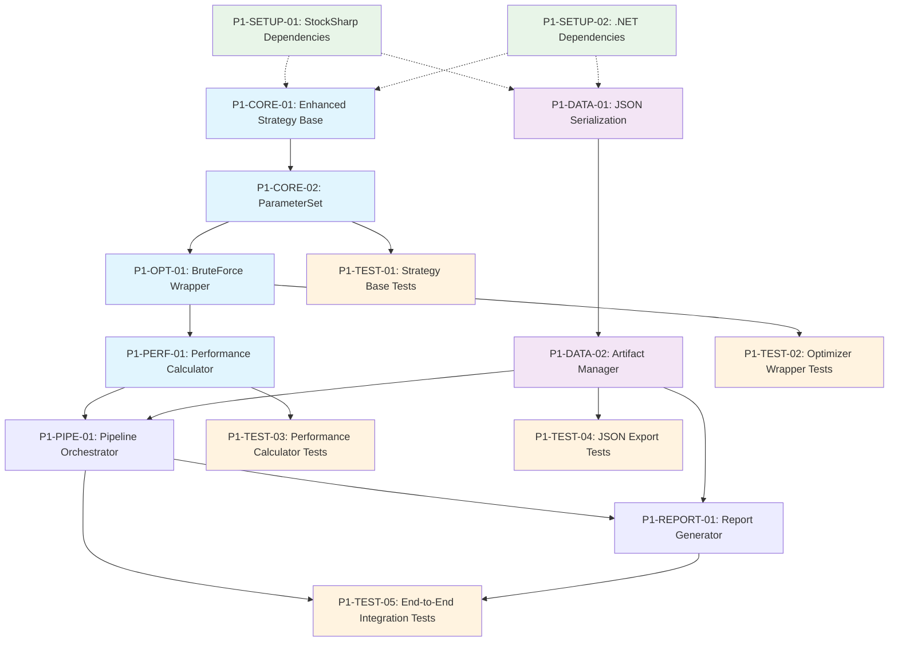

# Phase 1 Task Breakdown Summary - StockSharp Integration Foundation

## Overview

This document provides a comprehensive task breakdown for **Phase 1: StockSharp Integration Foundation** based on the Technical Requirements Document (TRD MVP). All tasks are designed to build enhanced wrappers around StockSharp's core optimization capabilities while maintaining 100% compatibility with the StockSharp ecosystem.

## Task Organization

### Priority Structure

**HIGH Priority Tasks (8 tasks)** - Core MVP functionality
- Foundation: P1-CORE-01, P1-CORE-02
- Optimization: P1-OPT-01
- Performance: P1-PERF-01
- Data Management: P1-DATA-01, P1-DATA-02
- Pipeline: P1-PIPE-01
- Reporting: P1-REPORT-01

**MEDIUM Priority Tasks (4 tasks)** - Testing and validation
- Testing: P1-TEST-01, P1-TEST-02, P1-TEST-03, P1-TEST-04

**LOW Priority Tasks (3 tasks)** - Setup and infrastructure
- Setup: P1-SETUP-01, P1-SETUP-02, P1-SETUP-03

### Agent Specialization

**dotnet-csharp-expert** (8 tasks)
- Core .NET implementation and StockSharp integration
- Serialization and wrapper development
- Unit and integration testing

**quantum-trading-expert** (2 tasks)
- Performance metrics and statistical analysis
- Trading algorithm validation

**data-architect** (1 task)
- Data management and artifact storage architecture

**solution-architect** (2 tasks)
- System architecture and pipeline orchestration

## Detailed Task Specifications Created

### Core Foundation Tasks

1. **P1-CORE-01: Enhanced Strategy Base Classes**
   - Extends StockSharp Strategy with enhanced capabilities
   - Parameter management, performance tracking, risk management
   - Full StockSharp compatibility maintained
   - **Dependencies**: None
   - **Deliverables**: EnhancedStrategyBase, IParameterValidator, event models

2. **P1-CORE-02: ParameterSet with Validation**
   - Comprehensive parameter management system
   - Validation rules, space exploration, serialization
   - Parameter hashing for optimization caching
   - **Dependencies**: P1-CORE-01
   - **Deliverables**: ParameterSet, ParameterDefinition, validation framework

### Integration Tasks

3. **P1-OPT-01: BruteForceOptimizerWrapper**
   - Wraps StockSharp BruteForceOptimizer with enhanced result capture
   - Real-time progress monitoring and error handling
   - Maintains StockSharp parallel processing capabilities
   - **Dependencies**: P1-CORE-01, P1-CORE-02
   - **Deliverables**: Wrapper, progress tracking, result models

4. **P1-PERF-01: PerformanceCalculator**
   - Enhanced metrics beyond StockSharp defaults
   - Risk-adjusted ratios, statistical significance testing
   - Trade analysis and drawdown statistics
   - **Dependencies**: P1-OPT-01
   - **Deliverables**: Comprehensive metrics, statistical tests, analysis models

### Data Management Tasks

5. **P1-DATA-01: JsonSerializationService**
   - High-performance JSON serialization using System.Text.Json
   - Progressive loading, compression, schema versioning
   - Financial data precision maintained
   - **Dependencies**: None
   - **Deliverables**: Serialization service, converters, schema management

6. **P1-DATA-02: ArtifactManager**
   - Hierarchical artifact storage and retrieval
   - Shared caching, cleanup policies, concurrent access
   - Performance-optimized indexing and search
   - **Dependencies**: P1-DATA-01
   - **Deliverables**: Storage management, indexing, cleanup system

## Implementation Flow

### Phase 1 Execution Sequence - REVISED

### Dependency Management

**Critical Path**: P1-CORE-01 → P1-CORE-02 → P1-OPT-01 → P1-PERF-01 → P1-PIPE-01

**Parallel Tracks**:
- Data Track: P1-DATA-01 → P1-DATA-02 → P1-REPORT-01
- Testing Track: Follows completion of core functionality

## Success Criteria

### MVP Completion Requirements

- [ ] **100% StockSharp Compatibility**: All functionality works with existing StockSharp strategies
- [ ] **Enhanced Performance Metrics**: Advanced metrics calculated accurately (Sharpe, Sortino, Calmar)
- [ ] **JSON Export Functional**: Complete optimization results exportable to valid JSON
- [ ] **HTML Reports Generated**: Basic reports created within 5 minutes
- [ ] **Full Test Coverage**: All components tested with unit and integration tests
- [ ] **End-to-End Pipeline**: Complete optimization workflow functional

### Quality Gates

1. **Foundation Complete**: P1-CORE-01, P1-CORE-02 verified working
2. **Optimization Ready**: P1-OPT-01 integrates successfully with StockSharp
3. **Metrics Available**: P1-PERF-01 produces accurate calculations
4. **Export Functional**: P1-DATA-01, P1-DATA-02 handle large datasets
5. **Pipeline Operational**: P1-PIPE-01 orchestrates complete workflow
6. **Reports Generated**: P1-REPORT-01 creates usable HTML output

## Project Tracking

### Documentation Structure

- **Priority Queue**: `docs/PROJECT-TRACKING/priority-queue.md`
- **Kanban Board**: `docs/PROJECT-TRACKING/kanban-board.md`
- **Epic Overview**: `docs/PROJECT-TRACKING/epics/overview.md`
- **Task Details**: `docs/PROJECT-TRACKING/epics/phase1-foundation-tasks/`

### Task Specifications Available

Each task includes:
- Technical requirements and implementation details
- Acceptance criteria and definition of done
- Dependencies and integration points
- Performance and quality requirements
- Agent assignment and expertise mapping

## Next Steps

### Immediate Actions

1. **Start P1-CORE-01**: Begin Enhanced Strategy Base Classes implementation
2. **Setup Environment**: Configure StockSharp dependencies and project structure
3. **Agent Coordination**: Assign tasks to appropriate specialist agents
4. **Progress Tracking**: Update kanban board as tasks move through workflow

### Phase 1 Timeline

**Estimated Duration**: 4-6 weeks for full Phase 1 completion
- Core Foundation: 2 weeks (P1-CORE-01, P1-CORE-02, P1-OPT-01)
- Performance & Data: 2 weeks (P1-PERF-01, P1-DATA-01, P1-DATA-02)
- Pipeline & Reports: 1 week (P1-PIPE-01, P1-REPORT-01)
- Testing & Integration: 1 week (All P1-TEST-* tasks)

## Technical Architecture Alignment

The task breakdown aligns with the technical architecture specified in the TRD MVP document:

- **StockSharp Integration**: Maintains full compatibility while adding enhancements
- **Modern .NET Patterns**: Leverages .NET 10 with dependency injection, structured logging
- **Performance Optimization**: Memory-efficient with parallel processing support
- **Pipeline Architecture**: Modular stages with artifact-based communication
- **JSON Export**: High-performance serialization with schema versioning

## Architectural Risk Assessment & Mitigation

### **HIGH PRIORITY RISKS**

1. **StockSharp Version Compatibility**
   - **Risk**: StockSharp updates may break our wrappers
   - **Mitigation**: Create adapter pattern with version detection, comprehensive integration tests
   - **Action**: Add versioning checks in P1-CORE-01 and P1-OPT-01

2. **Memory Management in Long Optimizations**
   - **Risk**: Memory exhaustion during large parameter space optimization
   - **Mitigation**: Implement streaming results, configurable memory limits, garbage collection tuning
   - **Action**: Add memory monitoring in P1-OPT-01 and P1-DATA-02

3. **Thread Safety in Parallel Processing**
   - **Risk**: Race conditions in concurrent optimization scenarios
   - **Mitigation**: Use thread-safe collections, implement proper locking patterns
   - **Action**: Add concurrency testing to all test tasks

### **MEDIUM PRIORITY RISKS**

4. **Performance Degradation**
   - **Risk**: Enhanced wrappers add significant overhead
   - **Mitigation**: Performance benchmarking, profiling, optimization passes
   - **Action**: Add performance requirements to all acceptance criteria

5. **Data Serialization Precision Loss**
   - **Risk**: Financial calculation precision lost in JSON serialization
   - **Mitigation**: Custom decimal converters, round-trip testing
   - **Action**: Enhanced precision testing in P1-DATA-01

## Enhanced Task Dependencies

### **Parallel Development Tracks**

**Track 1: Core Foundation** (Critical Path)
- P1-SETUP-01 → P1-CORE-01 → P1-CORE-02 → P1-OPT-01 → P1-PERF-01

**Track 2: Data Management** (Parallel)
- P1-SETUP-02 → P1-DATA-01 → P1-DATA-02

**Track 3: Integration** (Convergence)
- P1-PIPE-01 (requires Track 1 + Track 2)
- P1-REPORT-01 (requires Track 2 + P1-PERF-01)

**Track 4: Testing** (Following Implementation)
- Unit tests follow each component completion
- Integration tests follow track convergence

This comprehensive task breakdown provides the foundation for systematic development of the StockSharp Advanced Backtesting Library Phase 1 MVP.