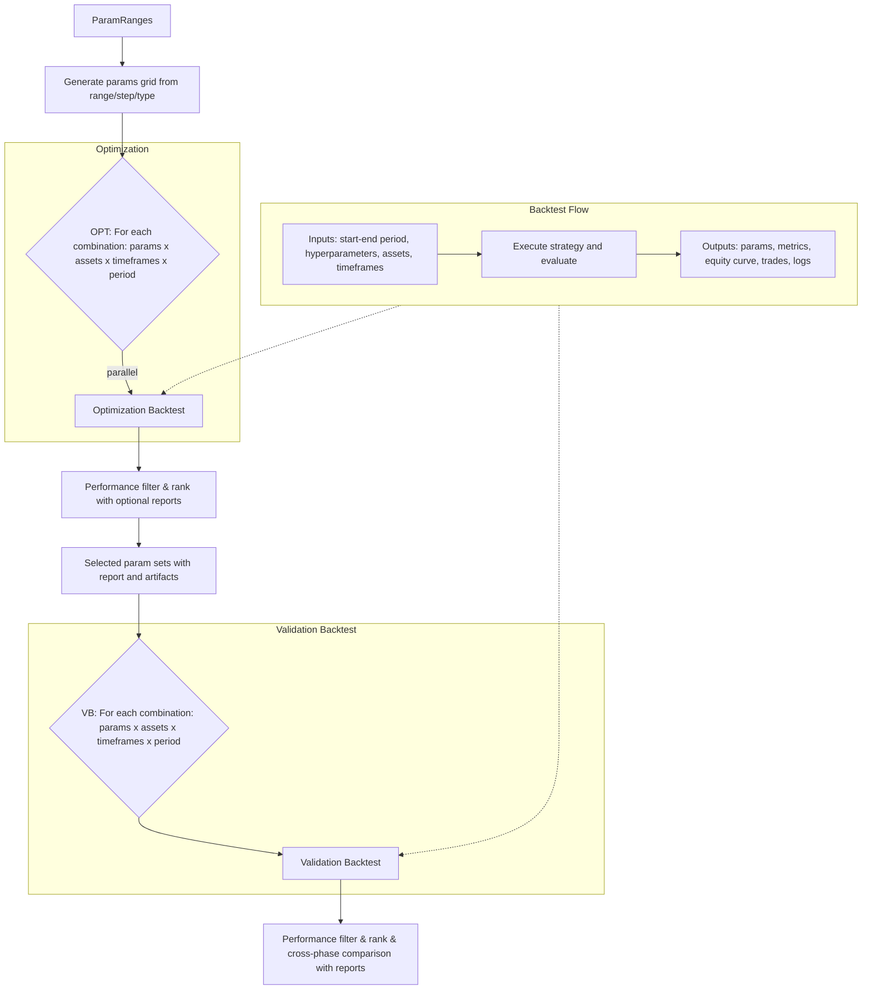

# MVP Architecture Diagram

```mermaid
flowchart TB
  A[Generate params grid from range/step/type] --> D
  D -->|parallel| B1
  B1 --> F
  F --> N[Selected param sets with report and artifacts]

  subgraph O[Optimization]
    direction LR
    D{OPT: For each combination: params x assets x timeframes x period}
    B1[Optimization Backtest]
  end

  F[Performance filter & rank with optional reports]

  subgraph VB[Validation Backtest]
    direction LR
    D1{ VB: For each combination: params x assets x timeframes x period}
    D1 --> B2[Validation Backtest]
  end

  S .-> B1
  S .-> B2

  subgraph S[Backtest Flow]
    direction LR
    S1[Inputs: start-end period, hyperparameters, assets, timeframes] --> S2[Execute strategy and evaluate]
    S2 --> S3[Outputs: params, metrics, equity curve, trades, logs]
  end

  N --> D1

  B2 --> F1[Performance filter & rank & cross-phase comparison with reports ]
  PR[ParamRanges] --> A
```
