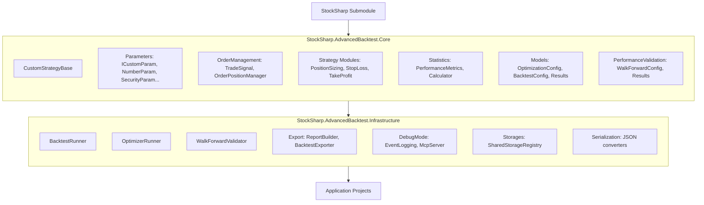
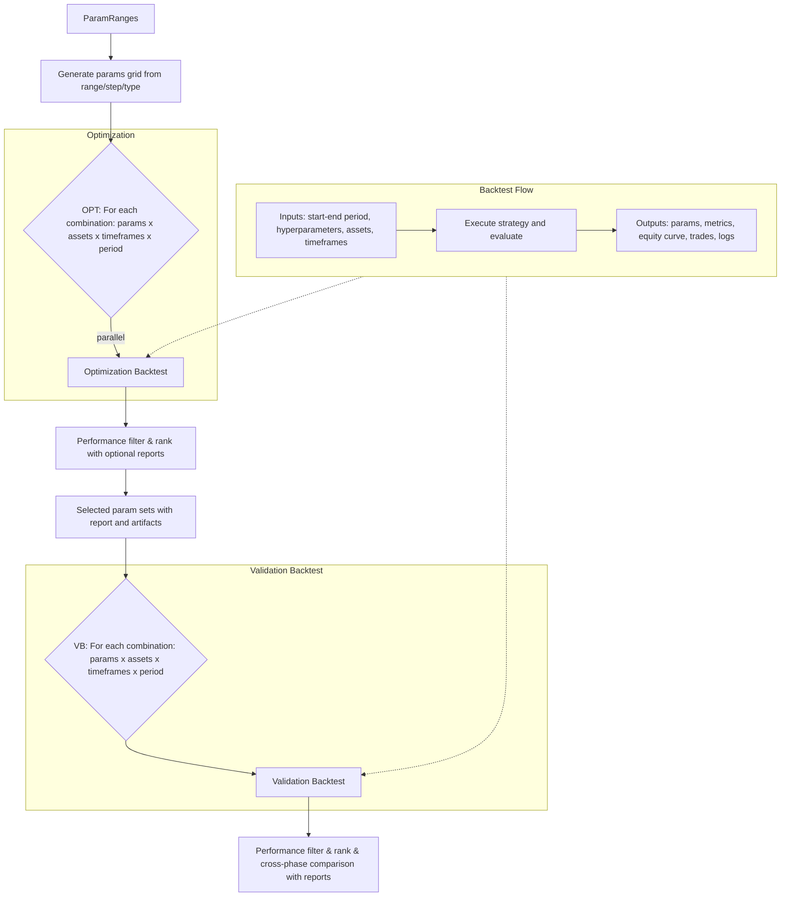

# MVP Architecture Diagram

## Assembly Structure

## Optimization & Validation Flow

## Component Mapping

| Component | Assembly | Responsibility |
|-----------|----------|----------------|
| CustomStrategyBase | Core | Base class for trading strategies |
| Strategy Modules | Core | Position sizing, stop-loss, take-profit calculators |
| OrderPositionManager | Core | Order and position tracking logic |
| TradeSignal | Core | Signal generation and representation |
| PerformanceMetrics | Core | Metric calculation (Sharpe, drawdown, etc.) |
| Parameters System | Core | ICustomParam, NumberParam, SecurityParam |
| BacktestRunner | Infrastructure | Backtest orchestration |
| OptimizerRunner | Infrastructure | Parallel optimization coordination |
| WalkForwardValidator | Infrastructure | Walk-forward analysis orchestration |
| ReportBuilder | Infrastructure | HTML/JSON report generation |
| EventLogging | Infrastructure | Debug event persistence (SQLite) |
| McpServer | Infrastructure | AI agentic debugging interface |
